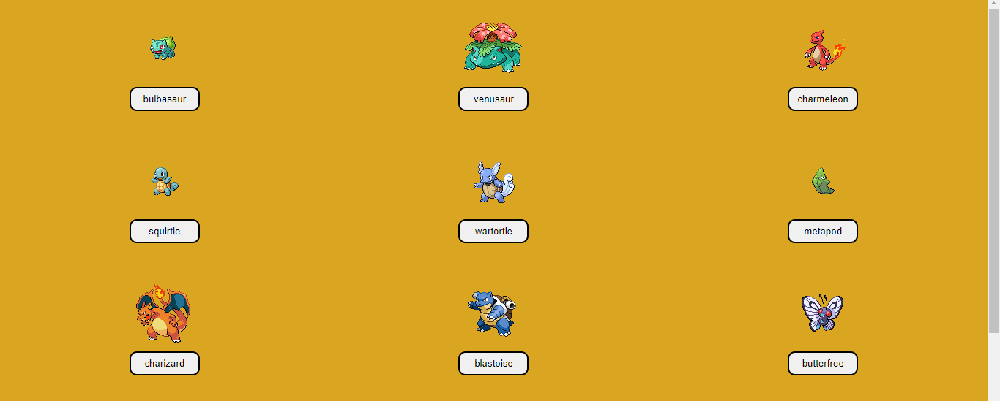
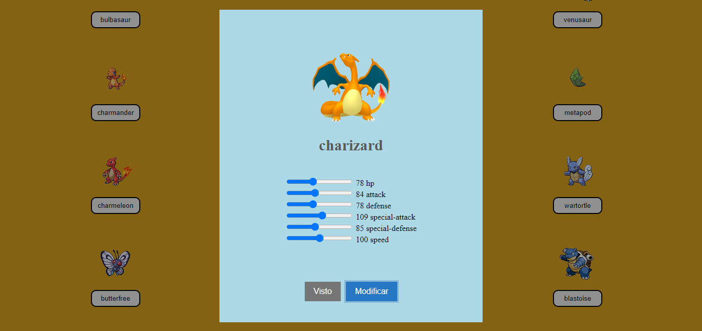
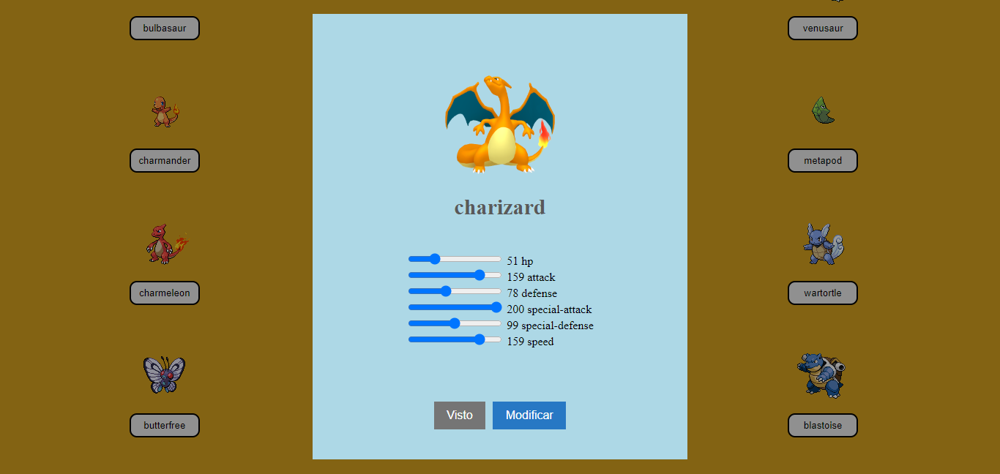

# Pokemon
Pokemon es una página web interactiva que permite visualizar las imágenes y el nombre de los pokemones, el nombre de los pokemones es un botón que al darle click, abre una ventana de dialogo en la que se puede observar las habilidades y/o estadísticas del pokemon seleccionado y estas pueden modificarse moviendo las barras que allí se observan y posteriormente guardarlas.

> Ver los pokemones



> Stats de los pokemones



> Stats modificadas de los pokemones



> [Ver proyecto](https://dfrincong.github.io/Pokemon/ )

## Características

* Se escogen la cantidad de pokemones que se quieren ver
* Se miran las estadísticas de los pokemones de forma interactiva
* Se puede cambiar las estadísticas de los pokemones y guardarlas

## ¿Cómo verlo?
1.	Se clona el repositorio
2.	Se abre el proyecto
3.	Se ejecuta index.html en la web

## Tecnologías usadas
-	html
-	css
-	js 
-	biblioteca Swal de sweetalert2

## Recursos útiles
> A continuación se detallan algunos recursos para la realización del proyecto.

### 1. Visualizar pokemones

**Method** : `GET`

**Version** : `v2`

**URL** : `https://pokeapi.co/api/v2/pokemon/`

**Storage** : `main.js`

**Response** : 

```js
document.addEventListener("click", async (e)=>{
    if(e.target.matches(".nombre")){
        let pokemon = await (await fetch(url + `${e.target.dataset.name}/`)).json();
        let img = pokemon.sprites.other.home.front_default;
        let defaultImg = "https://i.pinimg.com/originals/27/ae/5f/27ae5f34f585523fc884c2d479731e16.gif";
        Swal.fire()
```

---

### 2. Enviar estadísticas a MockApi

**Method** : `POST`

**URL** : `https://650ee92e54d18aabfe999cc6.mockapi.io/pokemon/`

**Storage** : `main.js`

**Response** :

```js
const enviar =  async(estadistica)=>{
    let config = {
        method: "POST",
        headers: {"content-type":"application/json"},
        body: JSON.stringify(estadistica)
    };
    let res = await (await fetch(urlMockApi, config)).json();
    console.log(res);
};
```

## Autor
> Daniel Felipe Rincón Guerrero
